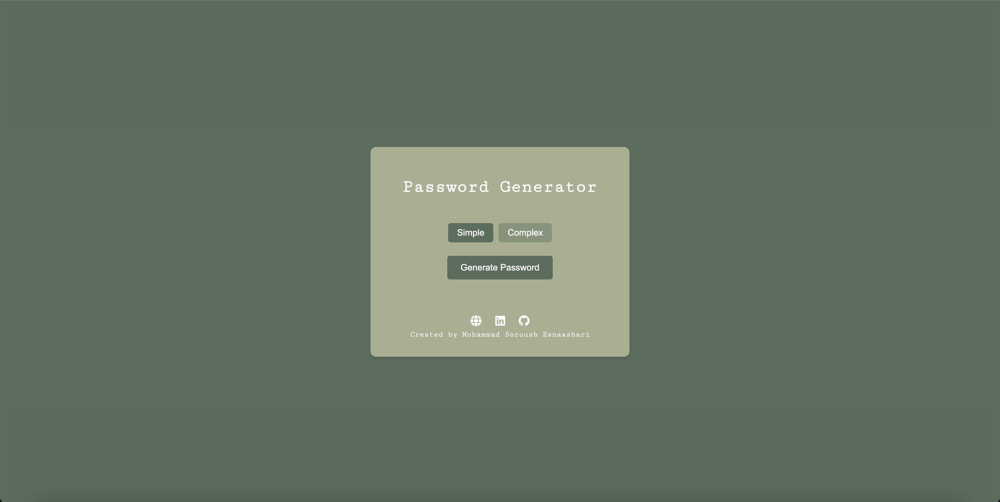

## Password Generator Web Application

A simple and secure web application for generating random passwords. Users can choose between **Simple** and **Complex** password formats, ensuring strong and customizable passwords for their needs.

 

### Features

- **Two Password Modes**:
  - **Simple**: Generates passwords in the format `****-****-****`.
  - **Complex**: Generates longer passwords in the format `****-****-****-****`.
- **Secure Passwords**: Includes uppercase letters, lowercase letters, numbers, and special symbols (`!@#$%&`).
- **Copy to Clipboard**: Easily copy generated passwords with a single click.
- **Responsive Design**: Works seamlessly on both desktop and mobile devices.
- **Social Links**: Connect with the creator via Website, LinkedIn and GitHub.

 

### How It Works

1. **Choose a Mode**: Select between **Simple** and **Complex** password formats.
2. **Generate Password**: Click the "Generate Password" button to create a random password.
3. **Copy Password**: Use the "Copy Password" button to copy the generated password to your clipboard.

 

### How to Contribute
Contributions are welcome! If you'd like to improve the project or add new features:

1. **Fork the repository.**
2. **Create a new branch.**
3. **Make your changes and submit a pull request.**
